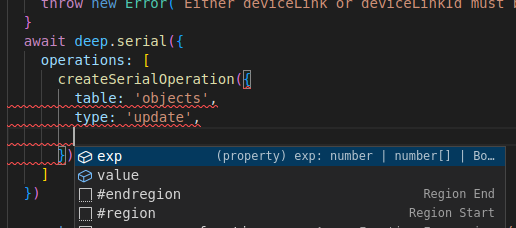

[источник](https://github.com/deep-foundation/documentation/wiki/DeepClient)
# deepclient
* ДАННАЯ СТРАНИЦА НАХОДИТСЯ НА ДОРАБОТКЕ


---
# FAQ
# My package unable to find link even if it exists
Make sure that your package have right permissions
## How to do insert+update+delete in one network request?
```ts
await deep.serial({
  operations: [
    createSerialOperation({
      table: 'links',
      type: 'insert',
      objects: [
        {
          type_id: typeTypeLinkId,
        },
      ],
    }),
    createSerialOperation({
      table: 'strings',
      type: 'update',
      exp: {
        id: linkId,
      },
      value: {
        value: 'newStringValue',
      },
    }),
    createSerialOperation({
      table: 'links',
      type: 'delete',
      exp: {
        id: linkId,
      },
    }),
    createSerialOperation({
      table: 'strings',
      type: 'insert',
      objects: {
        link_id,
        value,
      },
    }),
  ],
});

```

## What is `createSerialOperation` for?
With createSerialOperations you get the fields you need, depending on the selected table and operation, and when you don't use createSerialOperations you will see all the possible fields, even if you don't need them at all for your operation
If we do not use `createSerialOperation` typescript unable to defer types by using your arguments because typescript is bad at deep structures  
Without:  

With:  
   


## How to use idLocal?
By using idLocal you are able to get links-types from core package and links-types saved to your minilinks storage. To get a link-type from minilinks you have to save a package that contains the type-link, the contain link which points from the package link to your type-link, the type-link
