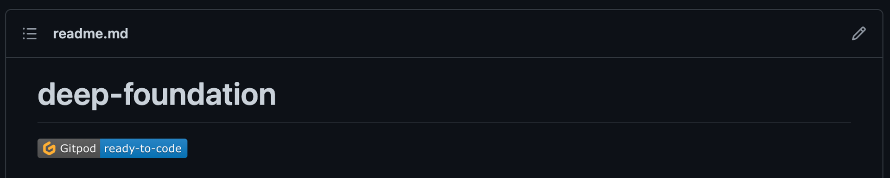
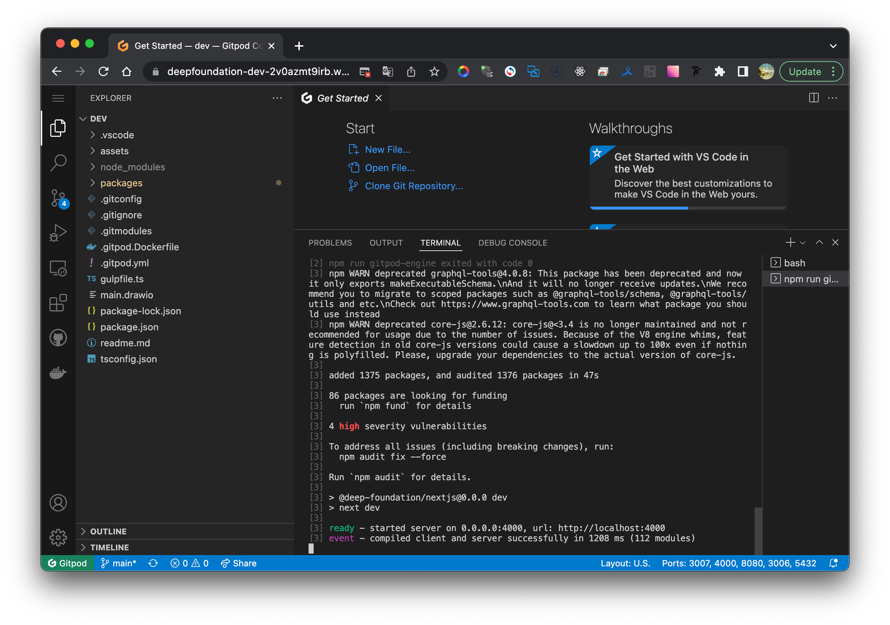
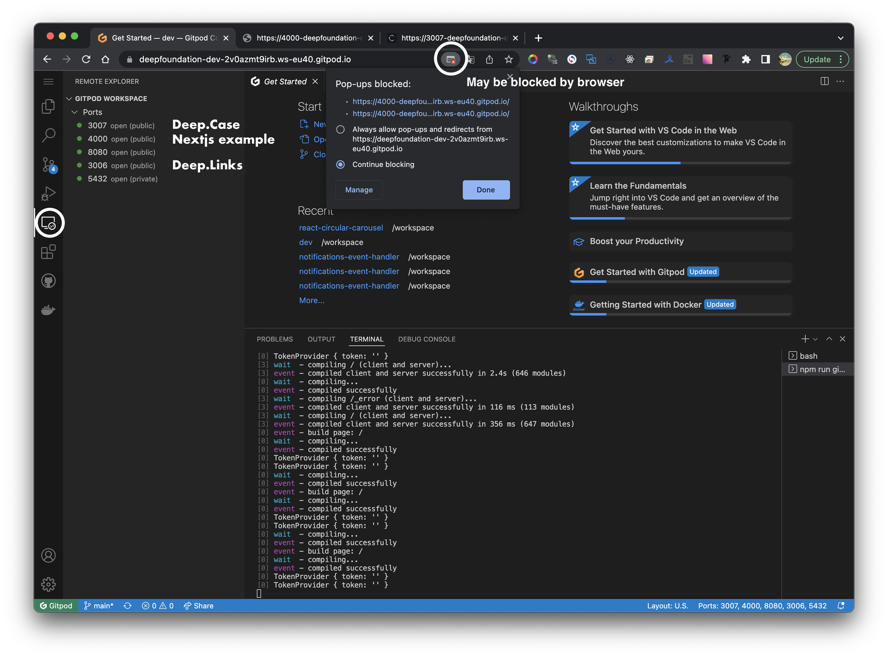
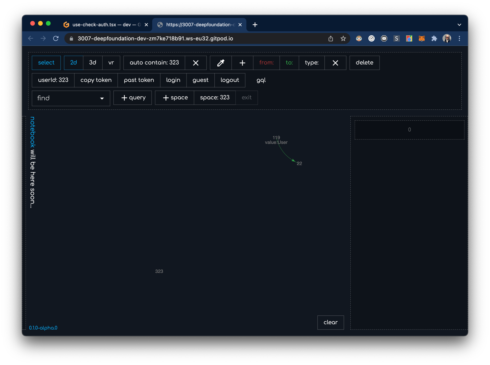

# GitPod developer cloud environment

Designed for quick experiments (like CodeSandbox), not for long development. But it can be handy for examples.

> This guide runs all systems in development mode in the GitPod cloud.

### Run
This is main developers mono repository.
[deep-foundation/#dev](https://github.com/deep-foundation/dev)

Here you can see button Gitpod ready-to-code. Click It.

> This button opens url similar to: [https://deepfoundation-dev-zm7ke718b91.ws-eu32.gitpod.io/](https://deepfoundation-dev-zm7ke718b91.ws-eu32.gitpod.io/)

Wait 1m until the example project on port 4000 is launched in the terminal.

3007 and 4000 port will try to open automatically, and may be blocked by browser.

You can see all available lunched ports and applications in the left panel tab `Remotes`.

> A tab will open during the process similar to: [https://3007-deepfoundation-dev-zm7ke718b91.ws-eu32.gitpod.io/](https://3007-deepfoundation-dev-zm7ke718b91.ws-eu32.gitpod.io/)

### Remigrate
Sometimes you need to clear the database and roll everything over again.
In this case, run:
`npm run gitpod-unmigrate`

And then:
`npm run gitpod-migrate`

Now you have fresh database migrations.

### Restart
Sometimes you need to restart `deeplinks` and `deepcase`.

To do this, you need to stop the process that is currently active. In terminal press `ctrl+c` and wait. To run `deeplinks` and `deepcase`, execute:

- `npm run gitpod-start` when where is no changes in `packages/deeplinks` and `packages/deepcase` folders.
- `npm run gitpod-wakeup` when where are changes in `packages/deeplinks` folder, for syncing in developer environment.