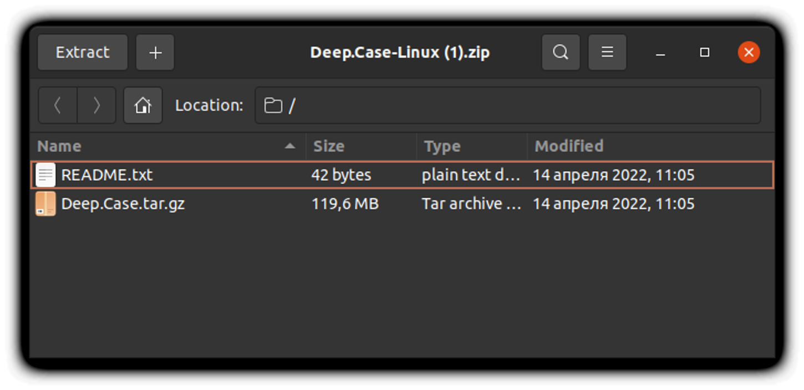

# Install Linux [Deep.Case](http://Deep.Case) application
# install
## install docker

Just install docker desctop [https://docs.docker.com/desktop/linux/install/](https://docs.docker.com/desktop/linux/install/)

Or install docker Engine with some steps:

- Engine: [https://docs.docker.com/engine/install/#server](https://docs.docker.com/engine/install/#server)
- Docker Compose (standalone): [https://docs.docker.com/compose/install/compose-plugin/#install-the-plugin-manually](https://docs.docker.com/compose/install/compose-plugin/#install-the-plugin-manually)
- Add current user to docker group [https://docs.docker.com/engine/install/linux-postinstall/](https://docs.docker.com/engine/install/linux-postinstall/)

## Install node

We trust nvm to manage node versions just exec

```bash
curl -o- <https://raw.githubusercontent.com/nvm-sh/nvm/v0.39.1/install.sh> | bash
```

or

```bash
wget -qO- <https://raw.githubusercontent.com/nvm-sh/nvm/v0.39.1/install.sh> | bash
```

and next

```bash
export NVM_DIR="$([ -z "${XDG_CONFIG_HOME-}" ] && printf %s "${HOME}/.nvm" || printf %s "${XDG_CONFIG_HOME}/nvm")"
[ -s "$NVM_DIR/nvm.sh" ] && \\. "$NVM_DIR/nvm.sh" # This loads nvm
```

after running the install script, if you get `nvm: command not found` or see no feedback from your terminal after you type `command -v nvm`, simply close your current terminal, open a new terminal, and try verifying again. Alternatively, you can run the following commands for the different shells on the command line:

```bash
*bash*: `source ~/.bashrc`

*zsh*: `source ~/.zshrc`

*ksh*: `. ~/.profile`
```

These should pick up the `nvm` command.

Now, when nvm is installed, install node ver for deep:

```bash
nvm install 14.15.0
```

## Download app

[github.com](https://github.com/deep-foundation/deepcase/suites/6122480775/artifacts/213049440)




Unzip and after run you will see


Click `run engine` to initialize docker containers with `PostgreSQL`, `Hasura` and `Deep.Links` and wait untill progress bar indicates loading.


<aside> ❕ Bug with disabled run engine. We already known. Cut and put again path into input.

</aside>

After running, you can see this:


<aside> 💡 If you see other anomaly result, please write comment here in notion, or create issue here.

</aside>


---
# Install Deep with shell
\* THIS PAGE HAS BEEN CHANGED, SINCE DOCKER INSTALLATION INSTRUCTIONS ARE ALREADY ON THE TOP

- Download and exec unix starter

```bash
mkdir deep && cd deep && curl <https://raw.githubusercontent.com/deep-foundation/deeplinks/main/docker-prod/deep/unix-start.sh> > ./unix-start.sh && chmod +x unix-start.sh && ./unix-start.sh
```

- If browser opened, and you see something like this


You are ready to explore deep associative university. Good luck!


---