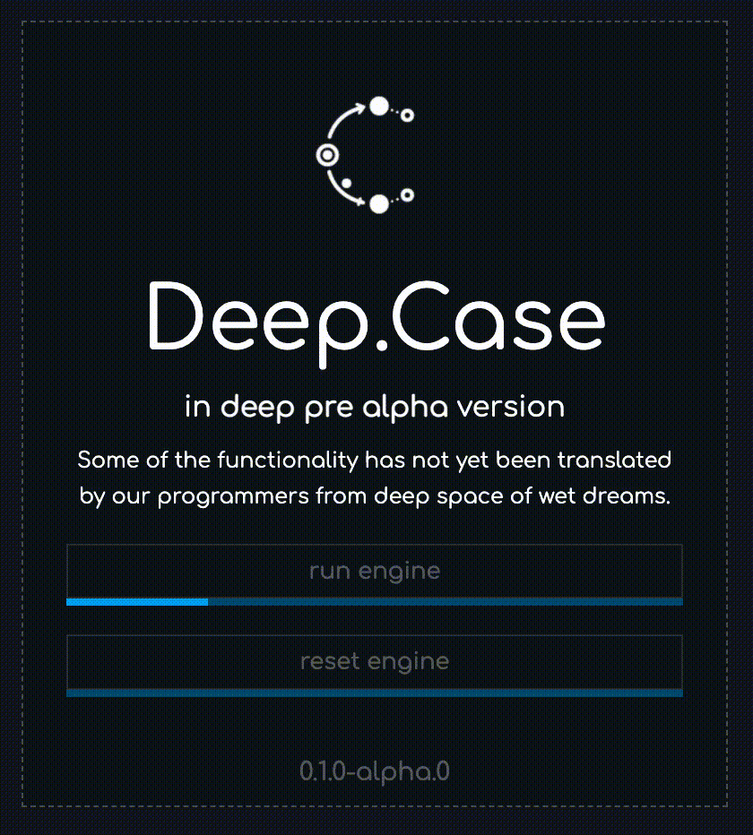

## Install docker

Open [https://docs.docker.com/desktop/mac/install/](https://docs.docker.com/desktop/mac/install/), then choose your chip type for .dmg downloading:


Simple step to install:


And go on, to open docker.


So, now you can see docker icon in your top bar, congratulations!


## Install node

We trust nvm to manage node versions, just exec

```bash
curl -o- <https://raw.githubusercontent.com/nvm-sh/nvm/v0.39.1/install.sh> | bash
```

or

```bash
wget -qO- <https://raw.githubusercontent.com/nvm-sh/nvm/v0.39.1/install.sh> | bash
```

and next

```bash
export NVM_DIR="$([ -z "${XDG_CONFIG_HOME-}" ] && printf %s "${HOME}/.nvm" || printf %s "${XDG_CONFIG_HOME}/nvm")"
[ -s "$NVM_DIR/nvm.sh" ] && \\. "$NVM_DIR/nvm.sh" # This loads nvm
```

Now, when nvm is installed, install node ver for deep:

```bash
nvm install 14.15.0
```

## Download app

[github.com](https://github.com/deep-foundation/deepcase/suites/6122480781/artifacts/213071506)


After run you can see.


Click `run engine` to initialize docker containers with `PostgreSQL`, `Hasura` and `Deep.Links` and wait untill progress bar indicates loading.



<aside> ❕ Bug with disabled run engine. We already known. Cut and put again path into input.

</aside>

After running, you can see this:


<aside> ❕ If you see other anomaly result, please write comment here in notion, or create issue here.

</aside>


---
# Install Deep with shell
\* THIS PAGE HAS BEEN CHANGED, SINCE DOCKER INSTALLATION INSTRUCTIONS ARE ALREADY ON THE TOP

- Download and exec unix starter

```bash
mkdir deep && cd deep && curl <https://raw.githubusercontent.com/deep-foundation/deeplinks/main/docker-prod/deep/unix-start.sh> > ./unix-start.sh && chmod +x unix-start.sh && ./unix-start.sh
```

- If you dont see opened browser, then open [http://localhost:3007/](http://localhost:3007/) manually
- If browser opened, and you see something like this    

You are ready to explore deep associative university. Good luck!


---