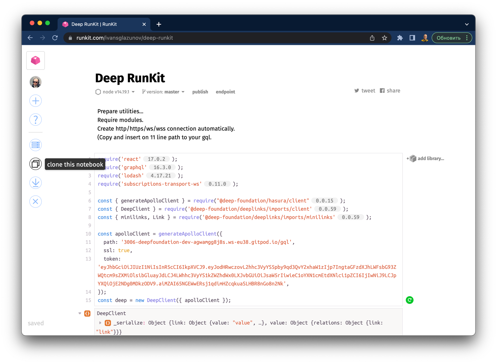

# RunKit as interactive terminal

If you've used npm and nodejs, then you probably know about runkit.

This can be useful in the early stages of experiments.

Just create new notebook in your account.

[RunKit](https://runkit.com/ivansglazunov)

Deploy deep in cloud with [GitPod developer cloud environment](https://www.notion.so/GitPod-developer-cloud-environment-1415dae2bb6e466db34be7e6c790ef65?pvs=21) guide.

Get GraphQL path url from [GraphQL](https://www.notion.so/GraphQL-12a676a2508541cf9a63cfeb564ffe7d?pvs=21) guide.

Example of runkit notebook you can take from here, just update path for apolloClient:

[RunKit](https://runkit.com/ivansglazunov/deep-runkit)

---

Hm, cool, Notion support embeded RunKit. But without personal deep instance for each example, this not such cool as sounds.

[https://runkit.com/ivansglazunov/deep-runkit](https://runkit.com/ivansglazunov/deep-runkit)

❕ Use [RunKit as interactive terminal](https://www.notion.so/RunKit-as-interactive-terminal-850dd594103e446ca895c3378f260009?pvs=21)!