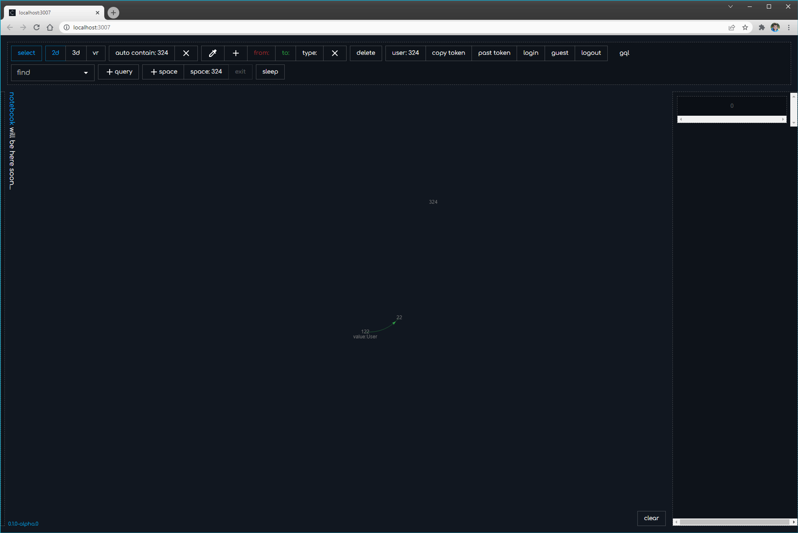

# Install Windows [Deep.Case](http://Deep.Case) application

## Install docker

download and install as is [https://docs.docker.com/desktop/windows/install/](https://docs.docker.com/desktop/windows/install/)


Reboot after install


Make your choice


## ATTENTION!
\* THIS BLOCK TAKEN FROM INSTALL_AND_USING/DOCKER_VERSION/WINDOWS

If you see error

You need to enable virtualisation in your BIOS settings.

\* END TAKED BLOCK

You may see “WSL2 Installation is incomplete”. Before clicking restart in window below - download and install kernel update [https://aka.ms/wsl2kernel](https://aka.ms/wsl2kernel)


Click restart, and if all is ok - you will see:


## ATTENTION!
\* THIS BLOCK TAKEN FROM INSTALL_AND_USING/DOCKER_VERSION/WINDOWS

If you see “docker stopping” for a long time in the docker window - you need to restart OS.

\* END TAKED BLOCK
## Install node

We trust nvm to manage node versions just download installer
[github](https://github.com/coreybutler/nvm-windows/releases/download/1.1.9/nvm-setup.zip)

After install you need to configure nvm

!! use cmd or PowerShell with administrative rights !!

```powershell
nvm install 14.15.0

nvm install 14.15.0
```


## Download app

[github](https://github.com/deep-foundation/deepcase/suites/6122480787/artifacts/213058939)


Unzip installer


After install open and you will see


Click `run engine` to initialize docker containers with `PostgreSQL`, `Hasura` and `Deep.Links` and wait untill progress bar indicates loading.


<aside> ❕ Bug with disabled run engine. We already known. Cut and put again path into input.

</aside>

After running, you can see this:


<aside> 💡 If you see other anomaly result, please write comment here in notion, or create issue here.

</aside>


---
# Install Deep with shell
\* THIS PAGE HAS BEEN CHANGED, SINCE DOCKER INSTALLATION INSTRUCTIONS ARE ALREADY ON THE TOP

- Use PowerShell as administrator to download starter windows-start.ps1 and execute it

```powershell
mkdir deep; cd deep; wget -Uri "<https://raw.githubusercontent.com/deep-foundation/deeplinks/main/docker-prod/deep/windows-start.ps1>" -OutFile ".\\windows-start.ps1"; Set-ExecutionPolicy -Scope CurrentUser RemoteSigned -Force; ./windows-start.ps1
```

- If browser opened, and you see something like this


You are ready to explore deep associative university. Good luck!