# установка среды для deepcase-app
#### УСТАНОВКА DOCKER


---
# Install Windows [Deep.Case](http://Deep.Case) application

## Install docker

download and install as is [https://docs.docker.com/desktop/windows/install/](https://docs.docker.com/desktop/windows/install/)
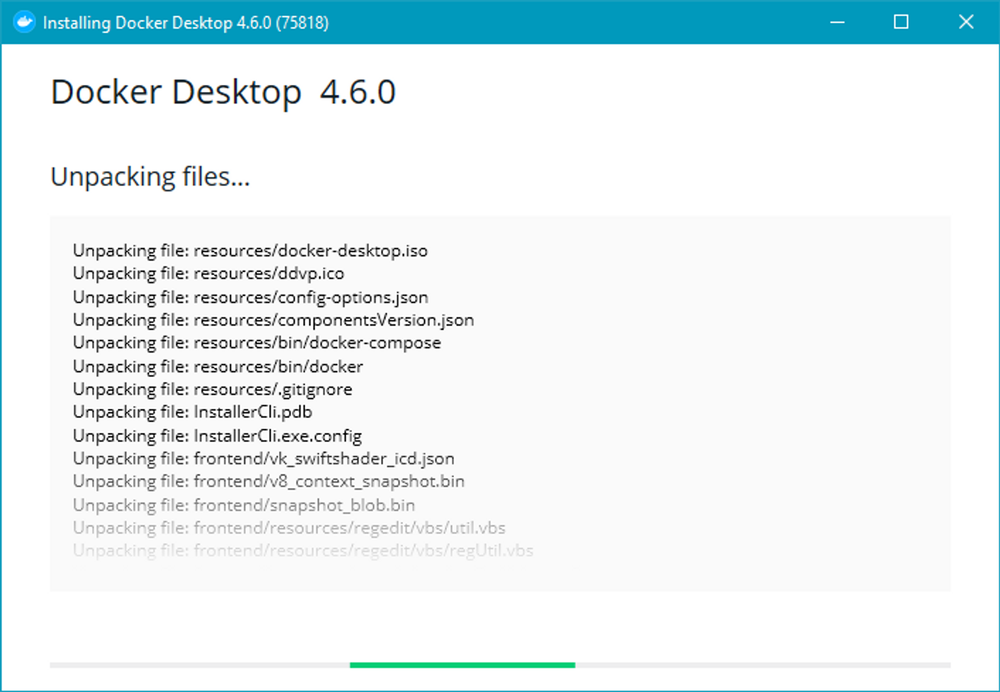

Reboot after install

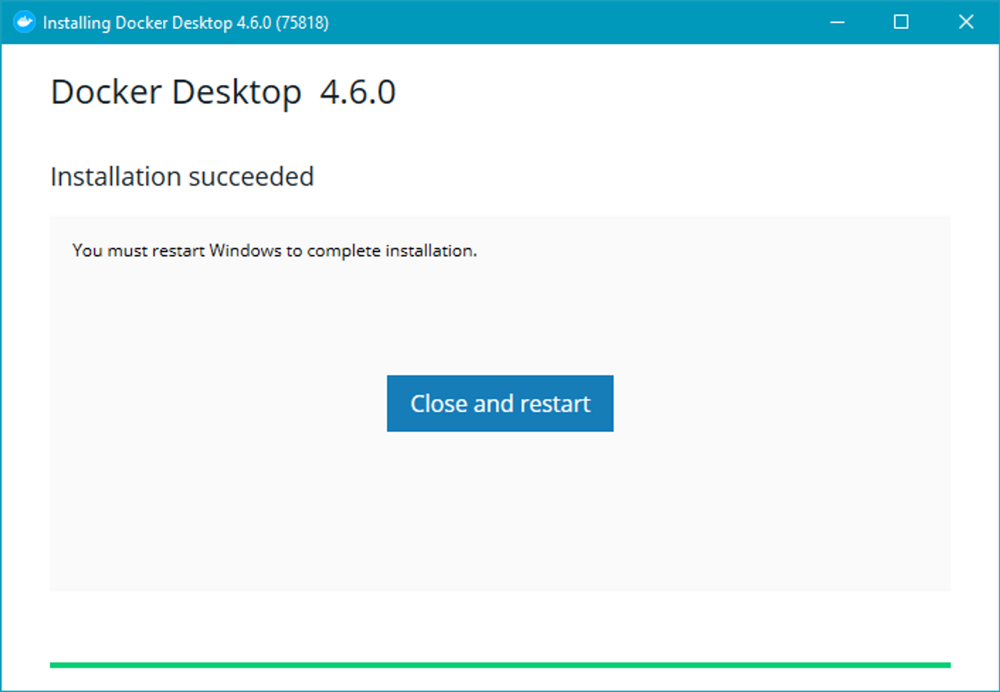

Make your choice

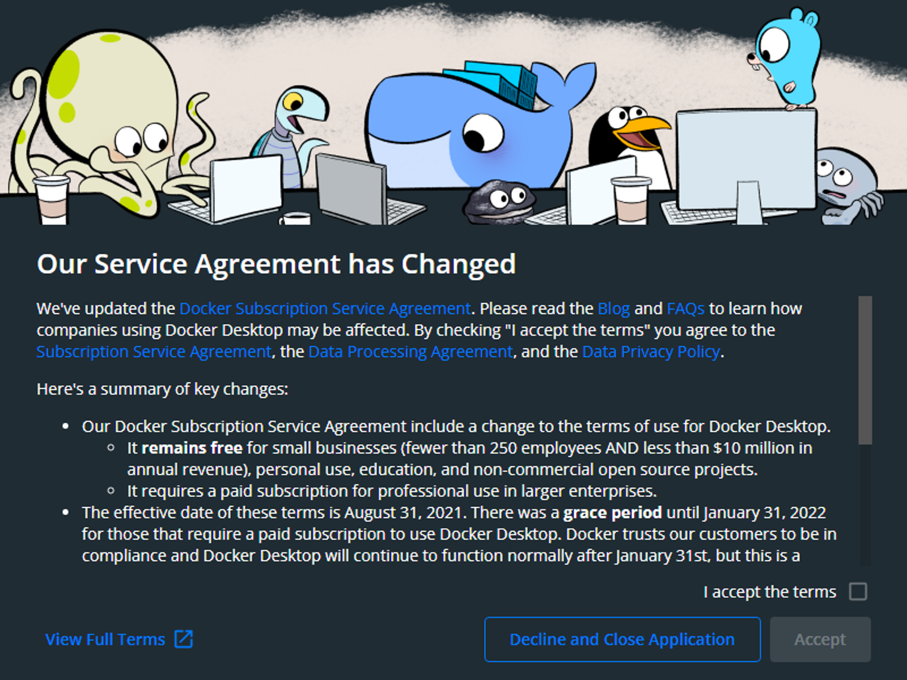

You may see “WSL2 Installation is incomplete”. Before clicking restart in window below - download and install kernel update [https://aka.ms/wsl2kernel](https://aka.ms/wsl2kernel)

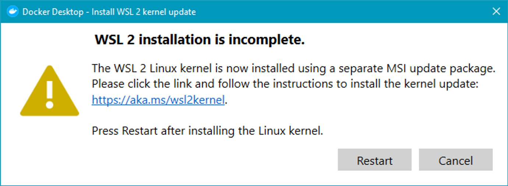

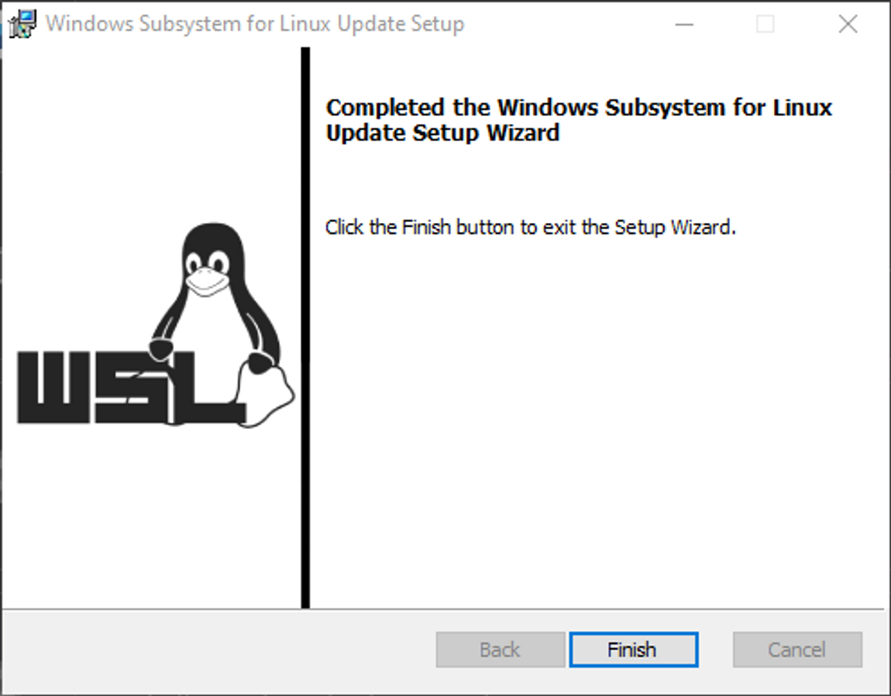

Click restart, and if all is ok - you will see:

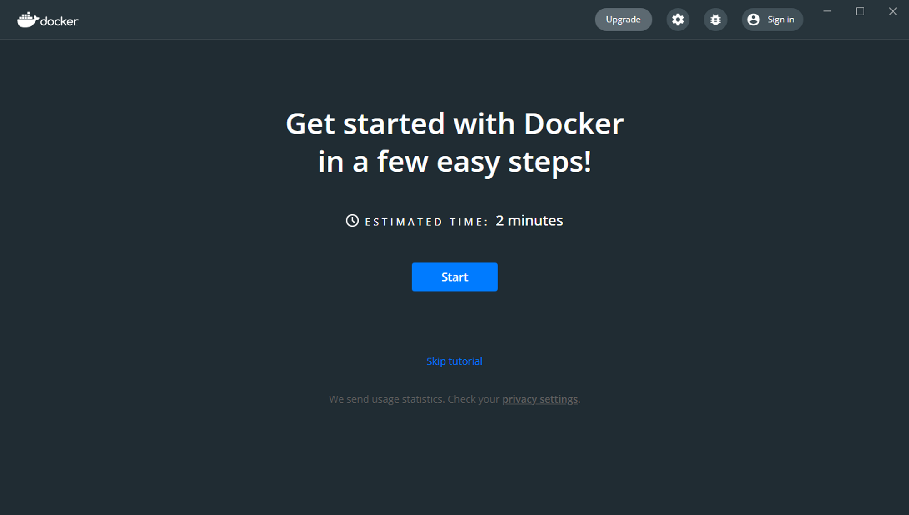

## Install node

We trust nvm to manage node versions just download installer
[github](https://github.com/coreybutler/nvm-windows/releases/download/1.1.9/nvm-setup.zip)

After install you need to configure nvm

!! use cmd or PowerShell with administrative rights !!

```powershell
nvm install 14.15.0

nvm install 14.15.0
```


## Download app

[github](https://github.com/deep-foundation/deepcase/suites/6122480787/artifacts/213058939)


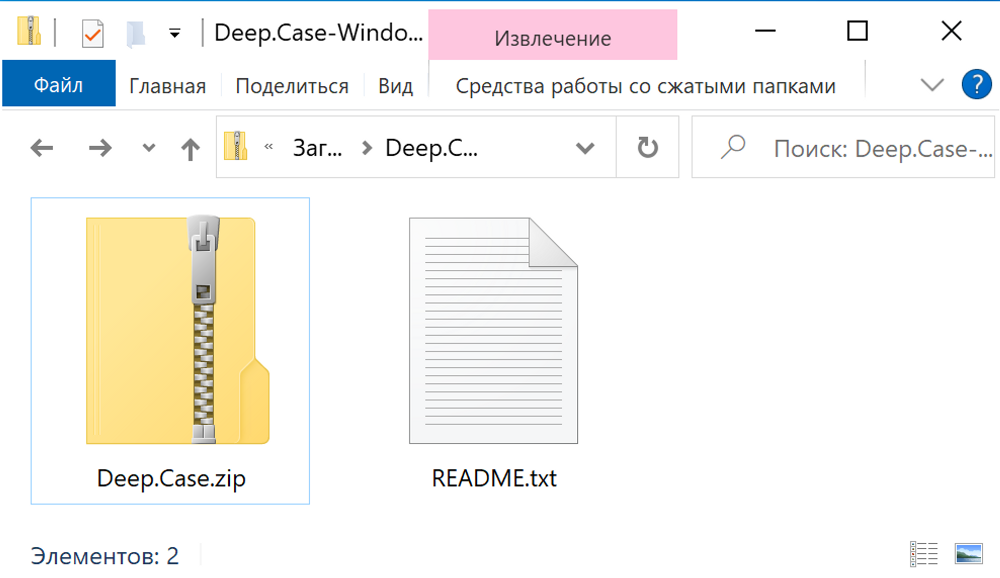

Unzip installer

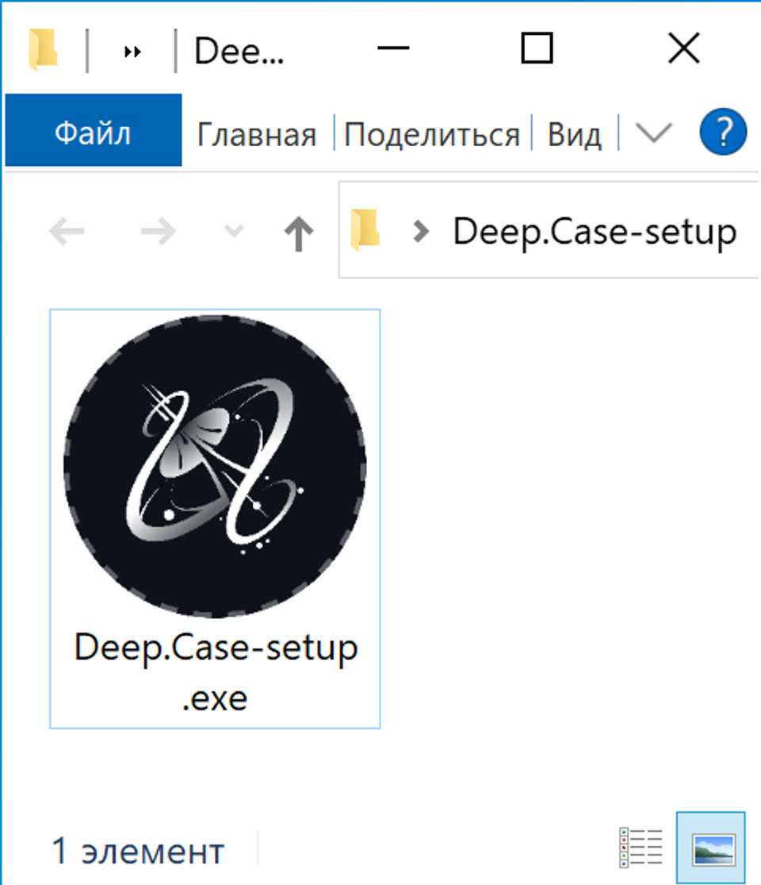
After install open and you will see


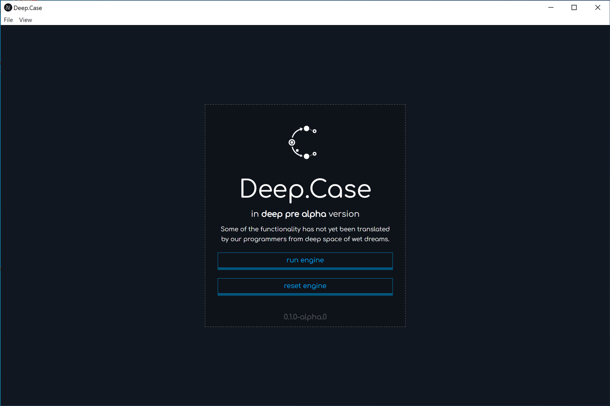

Click `run engine` to initialize docker containers with `PostgreSQL`, `Hasura` and `Deep.Links` and wait untill progress bar indicates loading.


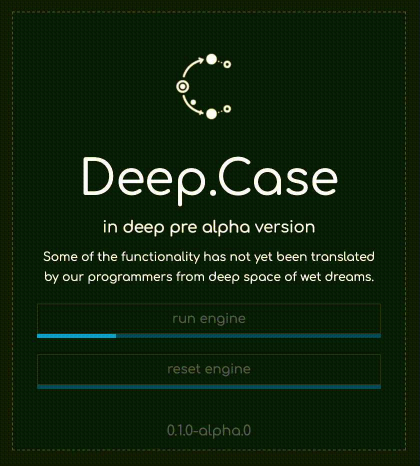

<aside> ❕ Bug with disabled run engine. We already known. Cut and put again path into input.

</aside>

After running, you can see this:


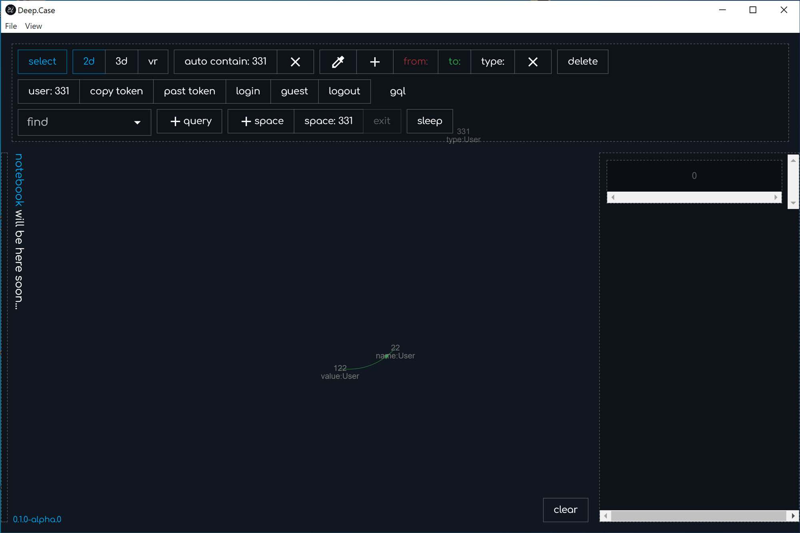

<aside> 💡 If you see other anomaly result, please write comment here in notion, or create issue here.

</aside>


---